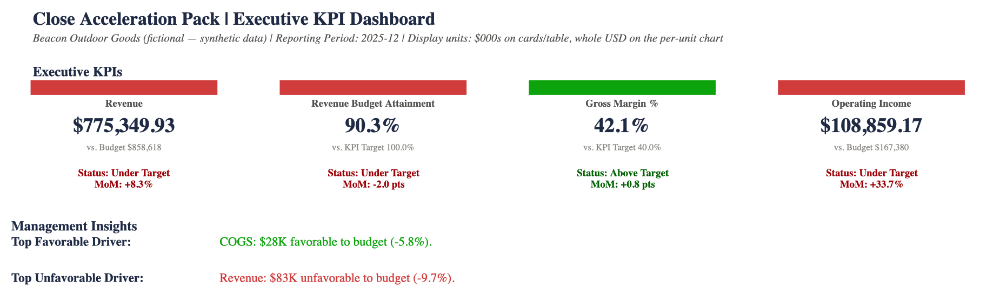
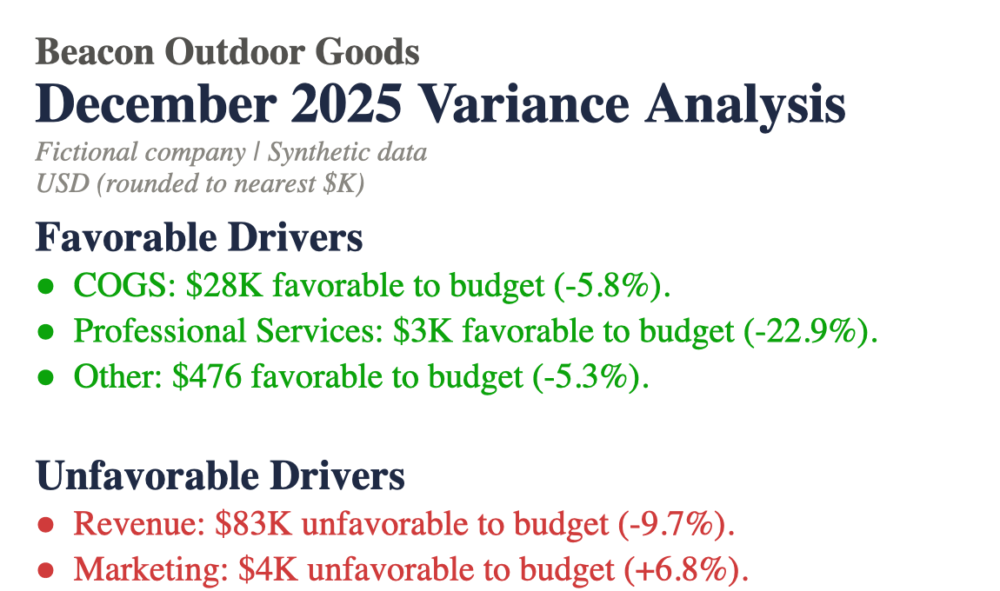
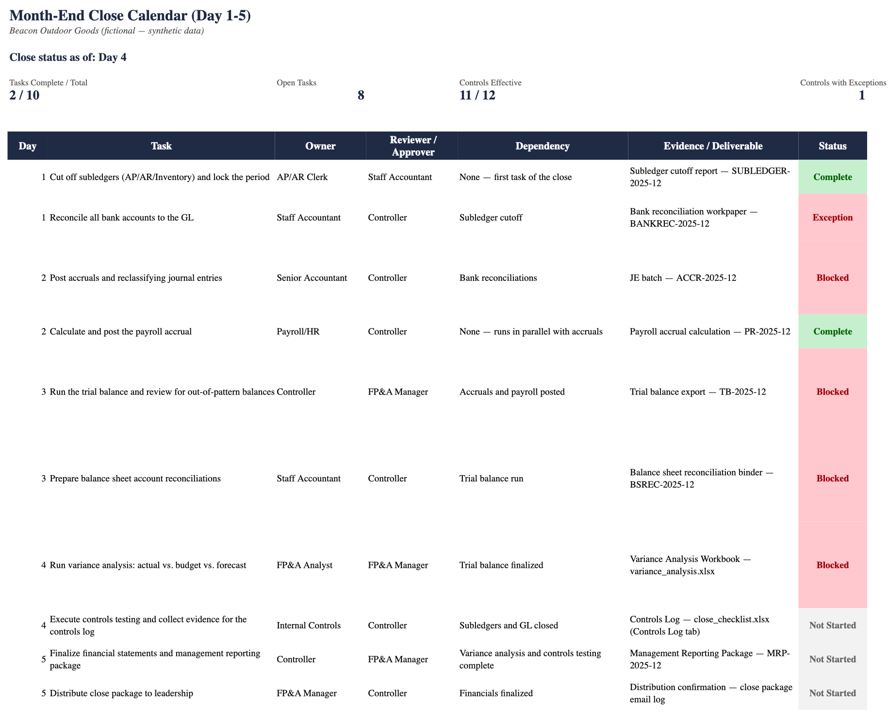

# Close Acceleration Pack

A Python/SQLite-to-Excel monthly-close reporting workflow for the fictional
consumer-goods company Beacon Outdoor Goods — one command turns a ledger
into three formatted, print-ready Excel deliverables a controller or FP&A
team would actually circulate.

## What it does

- **KPI Dashboard** — six executive KPI cards (Revenue, Budget Attainment
  %, Gross Margin %, Operating Income, Operating Margin %, Forecast
  Accuracy %) with plain-language status/trend labels, RAG-coded against
  target, three trend charts, and a management-insights block (top
  favorable driver, top unfavorable driver, risk & action) computed from
  the data every run.
- **Variance Analysis** — actuals vs. budget vs. forecast across the full
  P&L, with materiality-threshold flagging, an Operating Income waterfall
  bridge that reconciles exactly, and an auto-generated executive summary
  (top favorable/unfavorable drivers) — written from the numbers, not
  hand-typed.
- **Close Checklist & Controls Log** — a Day 1–5 close calendar (task,
  owner, reviewer/approver, dependency, evidence, status) with live
  dependency-cascade logic (a task can't stay "Complete" if a prerequisite
  is in Exception), plus a 12-control testing log spanning completeness,
  accuracy, and authorization, evaluated live against the dataset rather
  than hardcoded to "Effective."

## Architecture

```
Synthetic source data → SQLite → Python validation/calculations → Excel deliverables
```

Calculation modules (`variance.py`, `kpi.py`, `controls.py`) never import
`openpyxl` — they return plain pandas DataFrames/dicts and are unit-tested
as such. All spreadsheet formatting lives in `excel_export.py` alone, so
the math and the presentation are independently verifiable.

## Finance credibility

This isn't just numbers dropped into a template — the logic a reviewer
would actually check is implemented and tested:

- **Actual vs. Budget vs. Forecast**, computed from the same SQLite ledger
  for every P&L line, every month.
- **Favorable/unfavorable logic is economic, not sign-based** — a lower
  COGS actual is favorable even though it's a negative variance; a sign
  flip in a profit line (e.g. Operating Income crossing from positive to
  negative) is flagged as not-meaningful rather than shown as a
  misleading percentage.
- **Materiality handling** — variances are flagged only past a configurable
  threshold (±5% or $10K), so immaterial noise doesn't crowd out the
  drivers that matter.
- **Operating Income waterfall reconciles exactly** — built from leaf-level
  P&L lines only (never a calculated subtotal double-counted as its own
  bar); the bridge sums to the OI variance to the penny, asserted in tests
  and shown explicitly on the Waterfall sheet.
- **Close dependencies, control ownership, retained evidence, and
  exception handling** — the close calendar cascades status through task
  dependencies (a downstream task depending on an open Exception becomes
  Blocked, not silently Complete), and each of the 12 logged controls
  carries an owner, reviewer, evidence reference, and — when triggered —
  a specific exception note naming which comparison breached threshold.

## How to run

```bash
git clone <this-repo> && cd close-acceleration-pack
python3 -m venv .venv && source .venv/bin/activate
pip install -r requirements.txt
make all
```

That generates `output/variance_analysis.xlsx`, `output/kpi_dashboard.xlsx`,
and `output/close_checklist.xlsx` from a freshly-seeded database. No setup
needed to just look at the output, though — the current deliverables are
already committed in [`deliverables/`](deliverables/).

Other targets: `make test` runs the full suite; `make deliverables` copies
fresh output into `deliverables/`; `make dashboard-screenshots` regenerates
the screenshots below (macOS only, see
[`docs/generate_dashboard_screenshots.py`](docs/generate_dashboard_screenshots.py)).

## Validation

- `python -m unittest discover -s tests -v` — 60 tests covering variance
  math, waterfall reconciliation, KPI/RAG logic, controls dependency
  cascades, and end-to-end workbook generation.
- `tests/test_validation.py` independently reconstructs and checks the
  cross-cutting financial safeguards: OI waterfall reconciliation to the
  penny for every month, forecast accuracy computed with no look-ahead
  (quarterly forecasts use only actuals known before that quarter
  started), and sign-flip handling on profit-line variances.
- `tests/test_controls.py` checks the dependency-cascade logic (generic
  toy cases and the real scenario data) and the exact bps-threshold
  boundary behavior for the COGS-ratio control.
- Every test builds a **fresh** workbook in an isolated temp directory
  rather than just inspecting committed output, so a regression fails the
  suite instead of hiding in a stale file.

## Portfolio note

**Beacon Outdoor Goods and all financial data in this repository are
fictional and synthetically generated** (seeded RNG, reproducible from a
clean clone). This is a portfolio project demonstrating an FP&A reporting
workflow — not real company reporting, and not based on any actual
company's financials.

## Screenshots

**Executive KPI Dashboard**


**Variance Analysis — Favorable/Unfavorable Drivers**


**Close Calendar**


## Design decisions

**Why SQLite.** A single-file, auditable ledger with no server to stand
up — anyone reviewing this repo can open `data/close_pack.db` directly and
see exactly what fed the workbooks.

**Why the module boundaries (calculation vs. presentation).** Keeping
`openpyxl` entirely out of `variance.py`/`kpi.py`/`controls.py` is what
makes the math testable as plain DataFrames, independent of how it's
eventually drawn into a spreadsheet.

**Why synthetic data.** No real company's numbers appear anywhere in this
repo. The dataset is generated with a seeded RNG, so every test, control
result, and screenshot built on it is reproducible from a clean clone.

## Known limitations

- No line item in this model is called "EBITDA" — what's shown is
  Operating Margin % (`Operating Income / Revenue`) under its real name;
  the model has no D&A/interest line items, so true EBITDA can't be
  derived.
- No YoY growth metric is shown anywhere — this dataset covers one fiscal
  year, and synthesizing a second year from an assumed growth rate would
  be fabricated data presented as a real trend. `tests/test_validation.py`
  asserts it's absent from both the KPI registry and the database schema.

## Project docs

- [`SKILLS.md`](SKILLS.md) — full skill → file/function mapping
- [`ASSUMPTIONS.md`](ASSUMPTIONS.md) — every judgment call made while building this, and why
- [`REVIEW.md`](REVIEW.md) — per-phase self-review log
